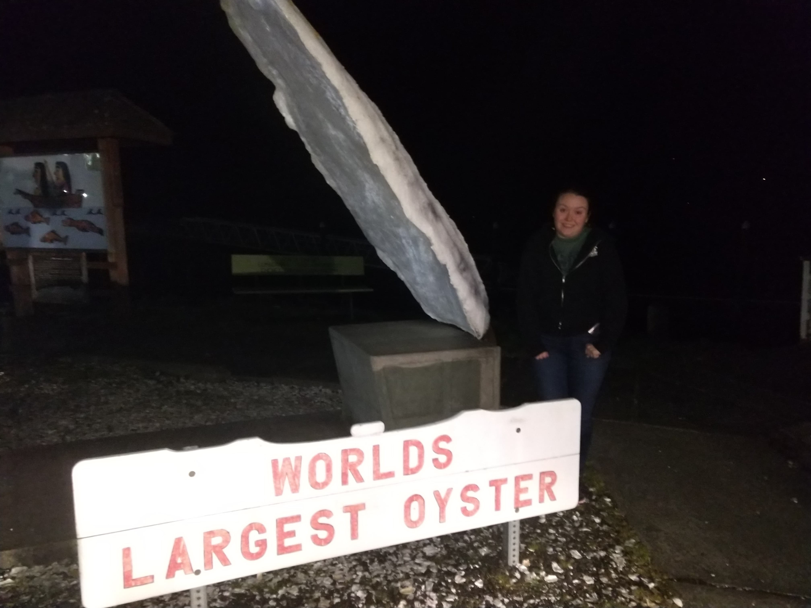

We started our trip today. Luckily, our POD containing all of our belongings was finally
picked up from our apartment -- we had a small snafu that led to it being parked in the
loading dock for a full week.

To start the trip, we dropped off our dog, Gage, at the Cascade Kennels in Woodinville, where
he will be staying for a few days until Katie's mom picks him up. We got a little bit of a late
start and were very hungry by that point, so we swing by Katie's favorite fast food mexican place:
Taco Time. It tasted really good, but was probably a bad decision since the greasy food messed
up our stomachs during the rest of the drive.

<iframe src="https://www.google.com/maps/embed?pb=!1m52!1m12!1m3!1d1393850.039986648!2d-124.2311730984289!3d46.97419730066057!2m3!1f0!2f0!3f0!3m2!1i1024!2i768!4f13.1!4m37!3e0!4m5!1s0x54900bfdd4f19947%3A0x6f9a6b2a29954e39!2sCascade+Kennels%2C+Inc.%2C+20005+178th+Ave+NE%2C+Woodinville%2C+WA+98072!3m2!1d47.772312!2d-122.104249!4m5!1s0x54900d990287ff15%3A0x8c41480ffcd52a6!2sTaco+Time%2C+Northeast+175th+Street%2C+Woodinville%2C+WA!3m2!1d47.7548855!2d-122.1536017!4m5!1s0x549174fcfebd0985%3A0x4432a80ad77ff31a!2sWashington+State+Capitol+Building+and+Campus%2C+Sid+Snyder+Avenue+Southwest%2C+Olympia%2C+WA!3m2!1d47.0357219!2d-122.9048303!4m5!1s0x5492445a1c04c10f%3A0x158e8cda2d8a5777!2sWestport+Viewing+Tower%2C+Westhaven+Drive%2C+Westport%2C+WA!3m2!1d46.9115095!2d-124.11746869999999!4m5!1s0x5493b1a5a792bd89%3A0x385b0a501c107df4!2sWorld%E2%80%99s+Largest+Oyster%2C+South+Bend%2C+WA!3m2!1d46.6663408!2d-123.8109143!4m5!1s0x54937b440995fb8b%3A0xf7dd72f1a11b8abf!2sAstoria%2C+OR!3m2!1d46.1878841!2d-123.8312534!5e0!3m2!1sen!2sus!4v1551595624671" width="600" height="450" frameborder="0" style="border:0" allowfullscreen></iframe>

Next, we headed over to Olympia, WA to see the state capitol. It was neat, but
we unfortunately were too late to go to the visitor's center, so we just took a few photos
outside.

After that, we drove 100 miles to the viewing tower in Westport, WA. It was getting
pretty dark and we couldn't see much, but we did notice the very large waves loudly
lapping the shore.

Right after, we drove into South Bend, WA to view the "World's Largest Oyster".
We knew it wasn't a real oyster, but we had to see it nonetheless.
Interestingly, there was only one half of the oyster!

After that, we hopped back on the 101 and drove into Astoria, where we are spending
the night. The drive was very interesting, running parallel to the ocean (which
we couldn't see) and it was extremely windy. When arriving in Astoria, you cross
an absolutely massive bridge, known as the [Astoria Megler bridge](https://en.wikipedia.org/wiki/Astoria%E2%80%93Megler_Bridge).
It is even longer than the 520 bridge in Seattle, coming in at a little over 4 miles in length.

We arrived at our motel, fairly tired from the exhaustive week of going away
parties and dinners, and ordered some pizza from a local shop.

I struggled for a while to get the pictures off of my phone, so we will be heading
to bed as soon as I finish writing.

Tomorrow, we are going to drive in Portland, OR where we are thinking about spending
the night.

We put a little more than 240 miles on the odometer today, but it will be a bit less
tomorrow. Hopefully, we will end up with more pictures, though!